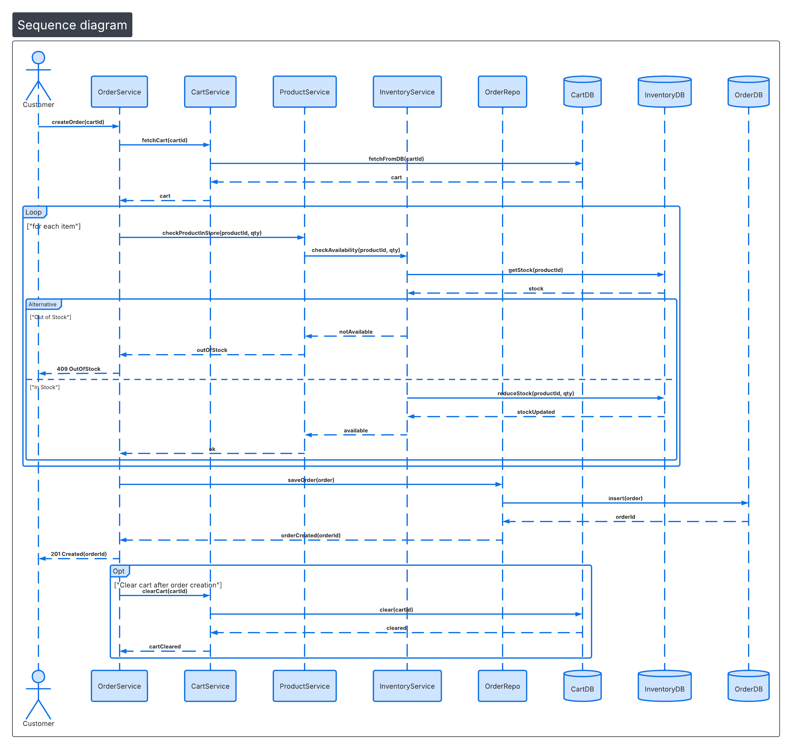

🛒 SmartCart — eCommerce Platform

A modern single-vendor eCommerce platform designed for independent sellers, featuring a clean customer storefront and a powerful admin panel for product and order management.

📌 Overview

SmartCart is a full-stack web application that enables customers to browse products, manage carts, and place orders securely.

The system is built with scalable architecture using a Modular Monolith design, making it ready for future microservices extraction.

🧱 Tech Stack
Layer	Technology
Frontend	Angular (SPA)
Backend	Spring Boot
Security	Spring Security + JWT
ORM	JPA / Hibernate
Database	MySQL
Language	Java 17

# 🏗 System Design

## Order Creation Flow

The following sequence diagram illustrates how an order is created in the system and how services interact to validate inventory, persist orders, and clear the cart.

### Flow Explanation

1. Customer sends `createOrder(cartId)` request.
2. `OrderService` fetches the cart from `CartService`.
3. For each cart item:
   - `ProductService` validates product existence.
   - `InventoryService` checks stock availability.
4. If stock is unavailable → request fails with `409 OutOfStock`.
5. If stock is available:
   - Inventory is reduced.
   - Order is persisted via `OrderRepo`.
6. Order is created and returned to the customer.
7. The cart is cleared after successful order creation.

# 🧰 Tools & Technologies

## Backend

- Java 17
- Spring Boot
- Spring Security (JWT)
- JPA / Hibernate
- MySQL

## Frontend

- Angular SPA
- Angular HttpClient

## Architecture & Design

- Modular Monolith Architecture
- RESTful API Design
- Sequence Diagrams
- Database Normalization (3NF)

## Dev Tools

- Git
- GitHub
- Maven
- IntelliJ / VS Code

🎯 Goals & Objectives
Business Goals

Launch MVP within 2–3 months

Provide end-to-end purchase flow

Enable complete product control for admins

Technical Goals

Stateless JWT authentication

RESTful API design

Modular Monolith architecture

Scalable microservice-ready structure

Clean Angular component architecture

👥 Target Users
👤 Customer

Customers can:

Browse products

Search products

Add items to cart

Checkout securely

View order history

👨‍💼 Admin

Admins can:

Add products

Update product details

Delete products

Monitor orders

📚 User Stories
🛍 Customer

Browse available products

Search for specific items

Add products to cart

Securely checkout orders

⚙ Admin

Add new products to the store

Update product information

Remove unavailable products

⚙ Functional Requirements
🔐 Authentication
Endpoint	Access
POST /register	Public
POST /login	Public
📦 Product Module
Endpoint	Access
GET /products	Public
POST /products	Admin
PUT /products/{id}	Admin
DELETE /products/{id}	Admin
🛒 Cart Module
Endpoint	Access
POST /cart/add	Authenticated
DELETE /cart/{itemId}	Authenticated
PATCH /cart/{itemId}	Authenticated
💳 Checkout
Endpoint	Access
POST /orders	Authenticated

Behavior

Creates order

Clears user cart

⚡ Non-Functional Requirements
Performance

Page load < 2 seconds

API response < 500ms

Pagination enforced

Security

BCrypt password hashing

JWT authentication

Input validation

SQL injection protection

Usability

Fully responsive Angular UI

Mobile-first design

Observability

Structured logging

Consistent API error responses

🏗 Architecture
Architectural Style

Modular Monolith

A single deployable application divided into bounded internal modules, allowing future migration to microservices.

System Architecture
Client Layer
   │
   ▼
Angular SPA
   │
HTTPS / REST
   │
   ▼
Spring Boot API Layer
   │
Spring Security (JWT)
   │
   ▼
Business Modules
   ├── User Module
   ├── Product Module
   ├── Cart Module
   ├── Order Module
   └── Admin Module
   │
   ▼
Data Layer
MySQL Database
🧠 Module Responsibilities
User Module

Authentication

Role management (ADMIN / CUSTOMER)

JWT token generation

Product Module

Product CRUD operations

Pagination

Indexed search

Cart Module

Per-user cart

Quantity management

Real-time total calculation

Order Module

Order creation

Order item persistence

Order lifecycle tracking

Admin Module

Product management

Order monitoring

🗄 Database Design
Schema Strategy

Fully normalized 3NF schema

Indexed Columns

product.name

product.category

Relationships
User 1 : 1 Cart
Cart 1 : N CartItem
CartItem N : 1 Product
User 1 : N Order
Order 1 : N OrderItem
OrderItem N : 1 Product
⚡ Performance Optimization
Pagination

Implemented using:

Spring Pageable
Indexing

Indexes applied on:

Product name

Product category

Lazy Loading

JPA relationships loaded on demand

N+1 Query Prevention

Using:

JOIN FETCH
🚀 Scalability Roadmap

Future enhancements include:

Microservices Migration

Possible service extraction:

User Service

Product Service

Order Service

Redis Caching

Cache:

Product catalog

Search results

Payment Gateway

Integration with:

Stripe

PayPal

CDN

Store product images using:

CloudFront

Cloudflare

⚠ Risks & Mitigation
Risk	Mitigation
Stock concurrency	Optimistic locking
Security misconfiguration	Security audit
Cart inconsistency	Server-side cart
Large catalog performance	Indexing + pagination
📊 Success Metrics
Product Metrics

Order success rate

Registered user growth

Operational Metrics

API response < 500ms

Zero critical admin failures

Zero critical security vulnerabilities
