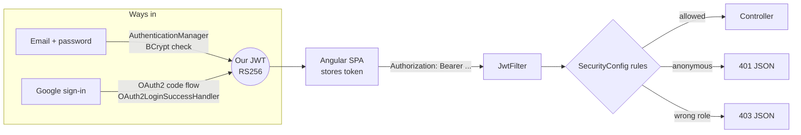
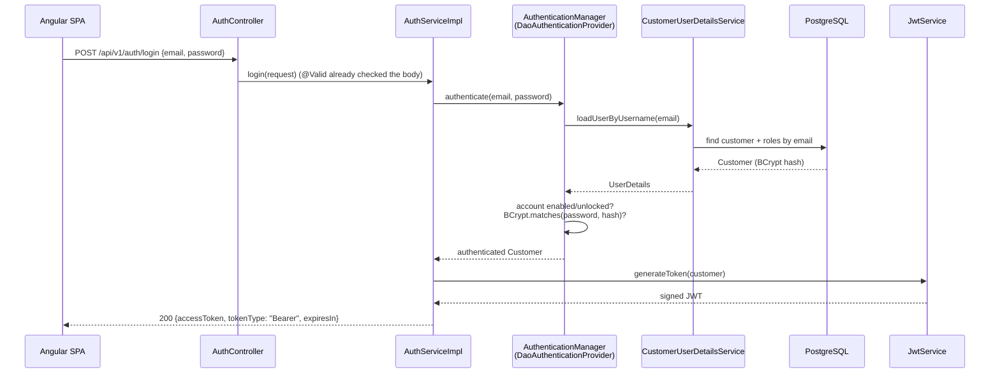
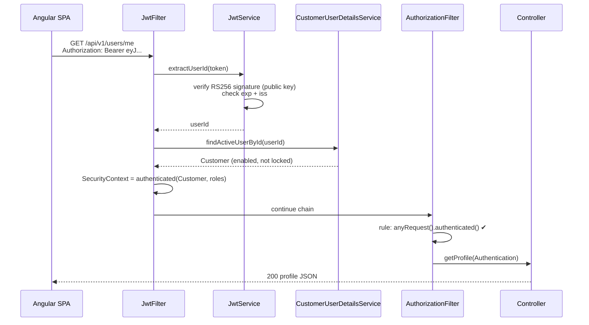
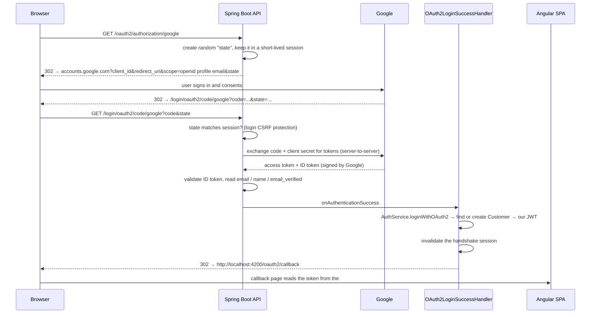

# SmartCart — Security Guide

How authentication and authorization work in the SmartCart backend, why each piece exists, and where to learn more.

Code lives in:

| Path | Role |
|---|---|
| `backend/eCommerce/src/main/java/com/example/eCommerce/config/SecurityConfig.java` | Wires everything together: filter chain, rules, CORS, password authentication |
| `.../security/SecurityProperties.java` | Typed, validated `app.security.*` settings |
| `.../security/KeyUtils.java` | Loads the RSA key pair from PEM files |
| `.../security/JwtService.java` | Issues and verifies our access tokens (JWT, RS256) |
| `.../security/JwtFilter.java` | Authenticates every request that carries a `Bearer` token |
| `.../security/CustomerUserDetailsService.java` | Bridge between Spring Security and the `customer` table |
| `.../security/RestSecurityErrorHandler.java` | Turns 401/403 into JSON `ProblemDetail` responses |
| `.../security/oauth2/OAuth2LoginSuccessHandler.java` | After Google sign-in: find/create the customer, issue our JWT, redirect to the SPA |
| `.../security/oauth2/OAuth2LoginFailureHandler.java` | Google sign-in failed or was cancelled: redirect to the SPA with an error code |

Related code outside the package: `user/services/AuthServiceImpl.java` (register, login, reactivate, Google provisioning), `config/BeansConfig.java` (BCrypt `PasswordEncoder`), `exception/GlobalExceptionHandler.java` (error JSON).

---

## 1. The big picture

There are **two ways in** and **one way through**:

- **Ways in** — prove who you are, once:
  - email + password (`POST /api/v1/auth/login`, `/register`, `/reactivate`), or
  - Google (`/oauth2/authorization/google`, the OAuth2 Authorization Code flow).
- **Way through** — both end with the backend issuing the **same kind of token**: a JWT signed with our RSA private key. From then on, every API call carries `Authorization: Bearer <token>`, and `JwtFilter` is the only thing that decides who the caller is.



Why not just use Google's token for API calls too? Because then the API would depend on Google for every request, and email/password users would need a different mechanism. Issuing our own token after *any* kind of sign-in keeps the rest of the system identical for everyone.

---

## 2. How a request flows through Spring Security

Spring Security is a chain of **servlet filters** that runs *before* `DispatcherServlet` and your controllers. The relevant ones, in order:

| # | Filter | What it does here |
|---|---|---|
| 1 | `CorsFilter` | Answers browser preflight `OPTIONS` requests and adds CORS headers |
| 2 | `OAuth2AuthorizationRequestRedirectFilter` | `/oauth2/authorization/google` → redirect to Google with a random `state` |
| 3 | `OAuth2LoginAuthenticationFilter` | `/login/oauth2/code/google` → validates `state`, exchanges the code, calls our success/failure handler |
| 4 | **`JwtFilter`** (ours) | Reads the `Bearer` token and, if valid, puts an `Authentication` in the `SecurityContext` |
| 5 | `ExceptionTranslationFilter` | Converts "not authenticated"/"access denied" into calls to our `RestSecurityErrorHandler` |
| 6 | `AuthorizationFilter` | Applies the `authorizeHttpRequests` rules: `permitAll` / `authenticated` |

Key idea: **authentication** ("who are you?") and **authorization** ("are you allowed?") are separate steps. `JwtFilter` only identifies the caller; it never rejects a request. A missing or bad token simply leaves the request anonymous, and the rules in step 6 decide: public endpoints still work, protected ones get a 401.

The `SecurityContext` is stored per thread (`SecurityContextHolder`) and cleared at the end of the request, so one user's identity can never leak into another request.

---

## 3. Flow by flow

### 3.1 Sign-up and password login



Security details worth noticing:

- **Passwords are BCrypt-hashed** (`BeansConfig`). BCrypt adds a random salt per password and is deliberately slow, so the same password gives a different hash every time, and stolen hashes are expensive to crack. That's also why you *must* compare with `passwordEncoder.matches(raw, hash)` and never `hash.equals(encode(raw))`; the original code had exactly that bug.
- **No user enumeration.** An unknown email and a wrong password both return the same `INVALID_CREDENTIALS` error. `CustomerUserDetailsService` throws `UsernameNotFoundException`, which Spring hides behind `BadCredentialsException`.
- **Deactivated accounts:** Spring checks "disabled" *before* the password. `AuthServiceImpl.login` therefore re-checks the password itself before telling the caller "this account is deactivated", so only the real owner learns the account state.
- **Sign-up** validates the input (password policy, phone + region, date in the past), rejects duplicate emails/phones with `409`, stores the phone in E.164 format, assigns `ROLE_CUSTOMER`, and returns a token right away.

### 3.2 An authenticated API call



The controller never reads a user id from the URL or body. It uses `AuthenticationUtil.getUserId(authentication)`, so a user can only ever act on **their own** data. This rules out the most common API vulnerability, IDOR (Insecure Direct Object Reference), by design.

### 3.3 Sign in with Google (OAuth2 Authorization Code + OpenID Connect)



Why each step matters:

- **Authorization Code flow.** The browser only ever sees a short-lived, one-time `code`. The exchange for real tokens happens server-to-server and uses the **client secret**, which never reaches the browser.
- **`state` parameter.** A random value tied to the user's session and checked on the way back. Without it, an attacker could make your browser complete *their* login ("login CSRF").
- **OpenID Connect** (`scope=openid`) gives a signed **ID token** stating who the user is. Spring validates it (signature, audience, expiry).
- **`email_verified` must be true.** We link accounts by email. If we trusted an unverified address, someone could create a provider account using *your* email and take over your SmartCart account.
- **Token in the URL fragment (`#token=`).** Browsers never send fragments to servers, so the token doesn't appear in server access logs or in the `Referer` header. The callback page also removes it from the address bar and history immediately.
- **Fixed redirect target.** The SPA URL comes from configuration (`app.security.oauth2.authorized-redirect-uri`), never from a request parameter. That prevents an open redirect that could send a fresh token to an attacker's site.
- **Session only for the handshake.** `STATELESS` means Spring Security never uses the session to remember who you are. The OAuth2 `state` still needs to survive the round trip to Google, so a session briefly exists and both handlers invalidate it.

### 3.4 Deactivate, reactivate, delete

- `PATCH /users/me/deactivate` sets `enabled = false`. The very next request with the old token fails, because `JwtFilter` reloads the user and `findActiveUserById` filters out disabled accounts. **This is how a stateless JWT is made revocable here.**
- `POST /auth/reactivate` is **public** on purpose: a deactivated user can't authenticate, so the endpoint checks email + password itself. Google users reactivate by signing in with Google again.
- `DELETE /users/me` deletes the customer; the database cascades orders and the cart.

### 3.5 Errors

Every security error leaves the API as an RFC 9457 `ProblemDetail` with a stable `code`:

```json
{ "status": 401, "title": "Unauthorized", "detail": "Authentication is required", "code": "UNAUTHORIZED" }
```

Security exceptions happen *inside filters*, before any controller, so `@RestControllerAdvice` would never see them. `RestSecurityErrorHandler` forwards them to Spring MVC's `HandlerExceptionResolver`, which routes them to `GlobalExceptionHandler`. Without it, `oauth2Login()` would answer anonymous API calls with a `302` to Google, which a JavaScript client can't use.

---

## 4. Class by class

### `SecurityConfig` (config package)
- **`securityFilterChain`**: the rules (see the table in §2). Public: `POST` register/login/reactivate, `GET` products, OAuth2 endpoints, API docs, `/error`. Everything else requires authentication. Matchers include the **HTTP method**, so only *reading* products is public.
- **`authenticationManager`**: `DaoAuthenticationProvider` = "load user by email + compare BCrypt hash".
- **`corsConfigurationSource`**: only the SPA origin, only the `Authorization` and `Content-Type` headers, no credentials (cookies), preflight cached for 1 h.
- It has **no constructor dependencies**; beans are injected into the `@Bean` methods. That's what broke the original circular dependency (`SecurityConfig → CustomerService → AuthenticationManager → SecurityConfig`).

### `SecurityProperties`
A `record` bound to `app.security.*` and validated at startup (`@Validated`). Missing keys or URLs stop the app immediately instead of failing on the first login.

### `KeyUtils`
PEM → Base64 → DER bytes → `KeyFactory`. Private keys use **PKCS#8** (`PKCS8EncodedKeySpec`); public keys use **X.509/SPKI** (`X509EncodedKeySpec`). Mixing these up was a bug in the original version.

### `JwtService`
- `generateToken`: `sub` = user id (stable, unlike email), `iss`, `iat`, `exp`, plus `email`/`roles` for the client's convenience. Signed **RS256** with the private key.
- `extractUserId`: verifies the signature with the public key, plus expiry and issuer, and rejects unsigned (`alg: none`) tokens. Throws `JwtException` on any problem.
- Roles in the token are **not trusted** for authorization; `JwtFilter` reloads them from the database.

### `JwtFilter`
Not a `@Component` on purpose: Spring Boot auto-registers every `Filter` bean as a servlet filter, so it would run twice. It's created inside `SecurityConfig` instead. Never rejects a request itself; it only sets the `SecurityContext` for valid tokens of active users.

### `CustomerUserDetailsService`
- `loadUserByUsername(email)`: for password login. Throws `UsernameNotFoundException` so Spring can hide it.
- `findActiveUserById(id)`: for `JwtFilter`. Returns the user only if they're enabled and not locked.

### `RestSecurityErrorHandler`
`commence` → **401** (not authenticated), `handle` → **403** (authenticated but not allowed). Both delegate to the MVC exception resolver for consistent JSON.

### `OAuth2LoginSuccessHandler` / `OAuth2LoginFailureHandler`
Bridge between Spring's OAuth2 login and our JWT world (see §3.3). Failures log details server-side but send only a generic `OAUTH2_FAILED` code to the browser.

---

## 5. Concepts behind the choices

### JWT: what it is and isn't
A JWT is `base64url(header).base64url(payload).signature`. The payload is **readable by anyone** (paste a token into jwt.io), so it must not hold secrets. The signature only guarantees the token wasn't **forged or modified**.

### RS256 (asymmetric) vs HS256 (symmetric)
| | HS256 | RS256 (ours) |
|---|---|---|
| Keys | One shared secret signs **and** verifies | Private key signs, public key verifies |
| Who can verify | Only holders of the secret, who can also *forge* tokens | Anyone with the public key; they can't forge |
| Fits | One service | Several services / future microservices (the README's roadmap) |

The original code generated a **random HMAC key at every startup**. Every restart logged everyone out, and two instances behind a load balancer would reject each other's tokens. Keys from configuration fix both problems.

### Stateless sessions and revocation
"Stateless" means the server keeps no login session; the token itself is the proof. The classic downside is that you can't revoke a token before it expires. We fix that by reloading the user on each request (one primary-key query). Alternatives: very short tokens plus refresh tokens, or a deny-list of token IDs.

### CSRF: why it's off
CSRF abuses credentials the **browser attaches automatically** (cookies). Our token travels in a header that JavaScript must add explicitly, and other sites can't read it, so a forged cross-site request arrives anonymous. **If tokens ever move to cookies, CSRF protection must be turned back on.**

### CORS: what it does (and doesn't)
CORS lets the browser allow JavaScript from `localhost:4200` to read responses from `localhost:8080`. It's a **browser** rule: it doesn't stop curl or other servers. Authentication does that. Never combine `allowedOrigins("*")` with authenticated APIs.

### Where the SPA keeps the token
The Angular app stores the JWT in `localStorage`. That's simple, but any injected script (XSS) can read it. The stronger design is an **HttpOnly, Secure, SameSite cookie** set by the backend, which JavaScript can't read; it then requires CSRF protection. Angular's template escaping is the main XSS defence in the meantime.

---

## 6. Threat model

| Threat | Mitigation in SmartCart |
|---|---|
| Stolen password database | BCrypt (salted, slow); passwords never logged (`toString()` overridden in DTOs) |
| Credential stuffing / brute force | ⚠️ Not yet: add rate limiting / lockout on `/auth/login` |
| User enumeration | Same error for unknown email and wrong password; account state revealed only with the right password |
| Forged or tampered token | RS256 signature + issuer check; `alg: none` rejected |
| Stolen token | 1-hour lifetime; deactivating the account revokes it immediately |
| Acting on other users' data (IDOR) | User id always taken from the token, never from the request |
| Login CSRF in OAuth2 | `state` parameter checked by Spring Security |
| Account takeover via OAuth2 | Only `email_verified = true` identities are linked |
| Token leaking via logs/Referer | Token in URL fragment; removed from history by the SPA |
| Open redirect after login | Redirect target fixed in configuration; `safeReturnUrl` in the SPA only allows in-app paths |
| Information leakage in errors | Generic messages to clients; details only in server logs |
| Secrets in git | `application-secrets.properties` and `keys/` are git-ignored. ⚠️ An old private key is still in git history: rotate it, never reuse it |

---

## 7. Known limitations / next steps

1. **Rate limiting** on login, register and reactivate (e.g. Bucket4j), plus account lockout after N failures.
2. **Refresh tokens**, so access tokens can be shorter-lived (5–15 min) without logging users out.
3. **HttpOnly cookie** storage for tokens, with CSRF protection re-enabled.
4. **Key rotation**: add a `kid` (key id) header and expose public keys as a **JWKS** endpoint so other services can verify tokens.
5. **Security headers** such as Content-Security-Policy and HSTS when served over HTTPS.
6. **Admin endpoints** with `@PreAuthorize("hasRole('ADMIN')")` (method security is already enabled).
7. **Tests**: `@WebMvcTest` + `spring-security-test` for each rule (anonymous → 401, wrong role → 403, own data only).

---

## 8. Study resources

All links checked on 2026-10-03.

### Start here (in this order)
1. **Spring Security architecture**: filters, `SecurityContext`, how a request is processed. https://docs.spring.io/spring-security/reference/servlet/architecture.html
2. **Authentication architecture**: `Authentication`, `AuthenticationManager`, providers. https://docs.spring.io/spring-security/reference/servlet/authentication/architecture.html
3. **JWT introduction** (jwt.io). https://jwt.io/introduction
4. **OAuth 2.0 Simplified** (Aaron Parecki), the friendliest explanation of OAuth flows. https://www.oauth.com/
5. **OWASP Authentication Cheat Sheet.** https://cheatsheetseries.owasp.org/cheatsheets/Authentication_Cheat_Sheet.html

### Spring Security reference (topics used in this project)
- `DaoAuthenticationProvider` (username/password): https://docs.spring.io/spring-security/reference/servlet/authentication/passwords/dao-authentication-provider.html
- Password storage and `PasswordEncoder`: https://docs.spring.io/spring-security/reference/features/authentication/password-storage.html
- OAuth2 Login: https://docs.spring.io/spring-security/reference/servlet/oauth2/login/index.html
- Authorizing HTTP requests: https://docs.spring.io/spring-security/reference/servlet/authorization/authorize-http-requests.html
- CORS: https://docs.spring.io/spring-security/reference/servlet/integrations/cors.html
- CSRF: https://docs.spring.io/spring-security/reference/servlet/exploits/csrf.html
- Spring Boot externalized configuration (`@ConfigurationProperties`): https://docs.spring.io/spring-boot/reference/features/external-config.html
- jjwt library (used by `JwtService`): https://github.com/jwtk/jjwt

### Standards (the source of truth)
- RFC 7519, JSON Web Token: https://datatracker.ietf.org/doc/html/rfc7519
- RFC 8725, JWT Best Current Practices: https://datatracker.ietf.org/doc/html/rfc8725
- RFC 6749, OAuth 2.0: https://datatracker.ietf.org/doc/html/rfc6749
- RFC 6750, Bearer token usage: https://datatracker.ietf.org/doc/html/rfc6750
- RFC 9700, OAuth 2.0 Security Best Current Practice: https://datatracker.ietf.org/doc/html/rfc9700
- OpenID Connect Core 1.0: https://openid.net/specs/openid-connect-core-1_0.html
- Google's OpenID Connect guide: https://developers.google.com/identity/openid-connect/openid-connect
- RFC 9457, Problem Details for HTTP APIs: https://datatracker.ietf.org/doc/html/rfc9457

### OWASP (what can go wrong)
- OWASP Top 10: https://owasp.org/Top10/
- OWASP API Security Top 10: https://owasp.org/API-Security/
- Password Storage: https://cheatsheetseries.owasp.org/cheatsheets/Password_Storage_Cheat_Sheet.html
- JSON Web Token: https://cheatsheetseries.owasp.org/cheatsheets/JSON_Web_Token_Cheat_Sheet.html
- Session Management: https://cheatsheetseries.owasp.org/cheatsheets/Session_Management_Cheat_Sheet.html
- CSRF Prevention: https://cheatsheetseries.owasp.org/cheatsheets/Cross-Site_Request_Forgery_Prevention_Cheat_Sheet.html
- Authorization: https://cheatsheetseries.owasp.org/cheatsheets/Authorization_Cheat_Sheet.html
- IDOR Prevention: https://cheatsheetseries.owasp.org/cheatsheets/Insecure_Direct_Object_Reference_Prevention_Cheat_Sheet.html
- HTML5 Security (token storage in the browser): https://cheatsheetseries.owasp.org/cheatsheets/HTML5_Security_Cheat_Sheet.html
- MDN, CORS explained: https://developer.mozilla.org/en-US/docs/Web/HTTP/Guides/CORS

### Books
- *Spring Security in Action, 2nd Edition*, Laurențiu Spilcă (Manning). https://www.manning.com/books/spring-security-in-action-second-edition
- *API Security in Action*, Neil Madden (Manning). Tokens, JWT, OAuth2, rate limiting. https://www.manning.com/books/api-security-in-action
- *OAuth 2 in Action*, Justin Richer & Antonio Sanso (Manning). https://www.manning.com/books/oauth-2-in-action

### Exercises using this codebase
1. Paste a token from the app into https://jwt.io and read its claims. Change one character of the payload and call `/api/v1/users/me` with it: you should get 401.
2. Deactivate an account in one tab and call the API with the old token in another. Why does it fail immediately?
3. Add an `ADMIN`-only endpoint with `@PreAuthorize("hasRole('ADMIN')")` and confirm a customer gets 403, not 401.
4. Write `@WebMvcTest` tests for the rules in `SecurityConfig` using `spring-security-test`.
5. Implement refresh tokens: what new risks appear, and how does RFC 9700 address them?
